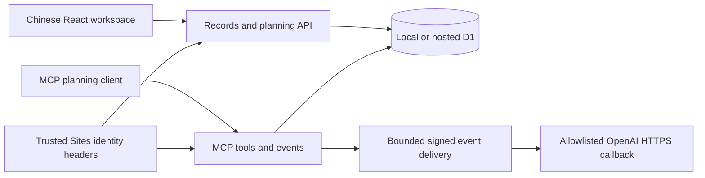

# VM1 initialization and validation

> Historical VM1 baseline: the identity observations below describe the imported version. Independent JWT verification, private membership, sessions and logout are now implemented; see [AUTHENTICATION.md](AUTHENTICATION.md) and [TESTING.md](TESTING.md). Live provider/ingress acceptance remains separate.

Validated on **2026-10-04 UTC**, on `ssh-vm-1`, in `/home/agent/projects/agent-task-hub`.

## Outcome and scope

Initial local verification completed: the locked installation, Worker build, TypeScript check, fresh D1 migrations, local API/MCP integration checks, and Chromium UI checks passed. **Lint remains failing** with 49 errors and two warnings in the imported application. This is a working local development baseline, not independent production deployment acceptance.

The original live Site was not connected or changed. No external application deployment, Git push, production data import, provider credential copy, or successful external webhook delivery was performed. All test identities and records were synthetic. Development, preview, and auxiliary Worker listeners were checked on loopback. Temporary servers were stopped after verification.

Logs, runnable verification scripts, screenshots, and the final summary are in:

```text
/home/agent/work/agent-task-hub/initial-validation
```

Existing files in that directory were retained. Application dependencies, build output, and SQLite state remain outside Git tracking.

## Baseline and local repairs

- Checkout HEAD: `f6a5419ddbf78ca10f640ad94e21e4a66d138de1` (`main`, tracking `origin/main`). Initial working tree was clean; no existing edits were overwritten. This repository commit differs from the upstream export source commit documented in `PACKAGING.md`.
- No applicable `AGENTS.md` was present in the checkout or its ancestor directories. `README.md`, `MIGRATION.md`, `PACKAGING.md`, and `ROADMAP.md` were read before installation.
- The original package manifest verified **126 matching files, zero modified files, and four missing files**: `.env.example`, `.gitignore`, `.npmrc`, and `.openai/hosting.json`. They were already absent from the committed checkout. `baseline.json` records this evidence.
- Reconstructed `.openai/hosting.json` with only logical `DB` and MCP declarations. This is a minimal functional reconstruction, not recovered original bytes. It has no project ID, production database ID, credentials, or deployment registration. R2 is unused.
- Added `.gitignore` for dependencies, build/cache outputs (including `.vinext`), local databases, runtime directories, and environment secrets; retained `build/` because it contains source tooling. Added a non-secret `.env.example`.
- The original `.npmrc` contents could not be established from the checksum alone. No speculative replacement was created. The portable locked installer succeeds with default npm settings; no dependency version was substituted.
- Changed Vite's default development bind address to `127.0.0.1` for both execution profiles and enabled strict port selection. The imported managed profile previously defaulted to `0.0.0.0`. Portable development still supplies the existing mock identity; managed development does not.
- Typed the hosting configuration's optional D1/R2 fields so a D1-only reconstruction passes TypeScript. The first typecheck identified the missing optional `r2` property; the final typecheck passed.
- Added a README link to this report. No application workflow or database migration was rewritten.

`MANIFEST.sha256` remains the original package provenance snapshot. Its missing-file hashes are not claims about reconstructed files, and it is not a manifest of this changed working tree. Review `git diff` and untracked source files for this validation's changes.

## Environment

| Item | Verified value |
| --- | --- |
| OS / architecture | Ubuntu 24.04.5 LTS / Linux x86_64 |
| Node / npm | Node `22.23.3`, npm `10.9.9` |
| Execution profile | Portable; no checkout-local profile override |
| Locked framework | Vinext `1.0.0-beta.5`, Vite `8.0.13`, React `19.2.6` |
| Locked Cloudflare tooling | Wrangler `4.92.0`, Vite plugin `1.37.1` |
| Locked TypeScript | `5.9.3` |
| Lockfile SHA-256 | `eedaeab6870c0f70f9db869fcaa24abae9b0f945cbc9acb8a43b6e7ed6bcbfca` |

Node was initially absent. The official `node-v22.23.3-linux-x64.tar.xz` was downloaded from the versioned `nodejs.org` distribution, verified against its published SHA-256 list, and extracted into `/home/agent/work/agent-task-hub/tools/node-v22.23.3-linux-x64`. Archive SHA-256: `df450af89261115ef9f9e3830c3eeb2cc9213b63c720b1af623cb5dcbe2e02de`. User-local `node`, `npm`, and `npx` symlinks in `/home/agent/.local/bin` make the tools available in the current shell; add that directory to PATH in any shell that omits it. No shell profile was overwritten.

Chromium verification used a separate Playwright `1.58.2` installation in `/home/agent/work/agent-task-hub/tools/browser`, with its downloaded browser under `/home/agent/.cache/ms-playwright`. Missing Ubuntu browser libraries/fonts were installed using Playwright's Chromium dependency installer; its package plan and installation log are retained. This tooling did not alter the application's package files or lockfile.

Repository SSH read access passed through the existing `git core.sshCommand`, using `git ls-remote --exit-code origin HEAD`; the remote HEAD matched the baseline checkout. Read/write access was not tested by pushing. No SSH key contents or provider credentials were read into logs. Repository access does not supply hosting authority.

## Current architecture



- `app/page.tsx` is the client workspace: Ideas → Plans → Tickets, manual status/evidence changes, Run snapshots, history, and ten-second refresh. Browser calls use `/api/records` and `/api/planning`.
- `app/api/records/route.ts` scopes records to the authenticated owner, uses optimistic revisions, preserves old bodies as history, and freezes a ticket contract when creating a Run. A Run is a stored record, not an execution process.
- `app/api/planning/route.ts`, `lib/planning-state.ts`, and `app/mcp/route.ts` manage revision-specific jobs. MCP supports idempotent idea creation, exclusive ten-minute claims, and atomic plan/ticket saves. Planning grants no execution authority.
- `lib/store.ts` accesses Worker `env.DB` directly. `db/schema.ts` and `drizzle/` describe `records`, `jobs`, and `subscriptions`; `db/index.ts` offers a Drizzle adapter. This is D1/SQLite storage, not a configurable generic Node database connection.
- `lib/events.ts` stores subscriptions in D1 and sends bounded, signed callbacks only to allowlisted OpenAI HTTPS hosts. No real subscriptions or signing secrets were configured in this run.
- `app/chatgpt-auth.ts` consumes trusted Sites identity headers. The Vite mock-sign-in middleware strips caller identity headers and creates a local synthetic identity only for accepted loopback requests. The built Worker does not implement standalone sessions, sign-in, or that middleware.
- `vite.config.ts`, `build/sites-worker.ts`, and the plugins integrate Vinext's RSC/SSR environments with Cloudflare Workers and development-only connector preview. Production output is `dist/`; generated configuration is `dist/server/wrangler.json`. Connector preview has no active host session here and is not proof of an independent connector service.
- No execution adapter, durable execution event stream, scheduler, device pairing, execution approvals, cancellation, or runner recovery is implemented. Those remain roadmap work.

## Validation evidence

Paths below are relative to the log directory stated above.

| Check | Result / evidence |
| --- | --- |
| Package baseline | 126 matching files and four missing dotfiles; `baseline.json` |
| Locked dependency installation | `npm run install:ci`, exit 0, 687 packages; `install.log`. Two deprecated transitive-package warnings. Lockfile unchanged. |
| Production build | `npm run build`, exit 0 before and after the config typing fix; `build-first.log`, `build-final.log`. Generated client assets and Worker config. Vinext reports `/` as statically unclassified; actual route was checked at runtime. |
| TypeScript | Initial optional-R2 configuration error resolved; final `npx --no-install tsc --noEmit`, exit 0; `typecheck-first.log`, `typecheck-final.log` |
| Fresh D1 migrations | Both committed SQL files applied once, in order, using local Wrangler; `migration-0000.log`, `migration-0001.log`. `database-fresh.json` confirms `records`, `jobs`, and `subscriptions` each had zero rows. |
| Dev and built preview | HTTP, assets, API and MCP checks passed at `127.0.0.1:5173` and `127.0.0.1:8787`; `api-checks-first.log`, `api-evidence.json`, `local-checks.py` |
| Chromium UI | Hydration, idea capture, Plan/Ticket/Run views, frozen evidence and reload persistence passed, with no page JavaScript errors; `browser-checks-passed.log`, `browser-evidence.json`, `browser-checks.mjs`, `dev-ui.png` |
| Listener isolation | All application/auxiliary listeners were loopback; `listeners-running.txt`. The VM's existing public SSH listeners are unrelated. Shutdown evidence: `listeners-stopped.txt`, `server-shutdown.json`. |
| Repository read access | Remote HEAD read through configured SSH command; `git-read-access.log` |
| Lint | Exit 1: 47 `no-explicit-any` errors, one `react-hooks/set-state-in-effect` error, one Next `no-html-link-for-pages` error, and two unused-variable warnings; `lint-first.log`, `lint-final.log`, `lint-summary.json`. Rules were not disabled. |
| Change hygiene | `git diff --check` passed; reviewable source changes remain uncommitted and unpushed. `final-review.json` records final tracked/untracked inventory and lockfile integrity. |

The API checks exercised anonymous denial for records/planning and authenticated MCP tools; public MCP discovery; mock-auth spoof stripping, host/origin/method/prefetch/redirect protections; same-origin writes; invalid ticket states/evidence and missing references; idea creation and job queuing; stale revision conflicts and history; superseded-job rejection; idempotent MCP creation; exclusive claims and invalid-token rejection; atomic/idempotent plan saves; rejection when an idea changes after claiming; and Run immutability after later ticket edits.

Built-preview checks used **explicit synthetic identity headers only on loopback** to verify owner-scoped reads and rejection of cross-owner record updates, planning requests, and MCP reads. This proves scoping after identity is supplied. It also confirms that a direct independent Worker endpoint would trust caller-supplied Sites identity: it must not be exposed as a secure standalone service. Passing a development mock cookie to the built preview still yields 401.

The browser harness blocked all external HTTP requests. The source stylesheet attempted Google Fonts requests; these were blocked and the UI remained usable with local fonts. Other external browser request attempts were absent. Early browser attempts failed because of missing OS libraries and test synchronization/ambiguous text selectors; those setup/harness issues were corrected without changing application behavior. Earlier failure logs are retained.

The local database now contains synthetic validation records and revision-specific jobs, including deliberately stale/claimed jobs from negative tests; subscriptions remain empty. `database-after-checks.json` records final counts. Nothing represents a real owner, production task, or completed execution.

## Reproduce local development

From the project directory, with Node on PATH:

```sh
npm run install:ci
npm run build
npx --no-install tsc --noEmit
```

Only if `.wrangler/state` contains a **new, empty local database**, apply the raw migrations once:

```sh
node --import ./scripts/sites-env.mjs ./node_modules/wrangler/bin/wrangler.js d1 execute DB --local --config dist/server/wrangler.json --persist-to .wrangler/state --file drizzle/0000_lethal_shadow_king.sql
node --import ./scripts/sites-env.mjs ./node_modules/wrangler/bin/wrangler.js d1 execute DB --local --config dist/server/wrangler.json --persist-to .wrangler/state --file drizzle/0001_keen_eddie_brock.sql
```

These files have already been applied on VM1. Do not reapply them to the existing state. A future repeat from zero should first stop local servers and preserve the existing local state in a separate ignored directory; never point this exercise at a remote database.

For authenticated development:

```sh
npm run dev
```

Visit `http://127.0.0.1:5173/signin-with-chatgpt?return_to=/` using local access or an SSH loopback tunnel. Keep the browser hostname and API origin consistent. Do not expose the port through a public proxy or override the loopback bind.

For built Worker preview:

```sh
npm start -- --port 8787
```

This script already sets `--local`, `--ip 127.0.0.1`, local persistence, and a disabled inspector. It does not simulate sign-in. The unmodified browser UI shows an authentication error when its APIs return 401; that is expected outside Sites.

The API verification script expects a fresh migrated database and creates fixtures. The browser script expects those API fixtures and adds a uniquely named synthetic idea. Run them only against the corresponding loopback servers:

```sh
python3 /home/agent/work/agent-task-hub/initial-validation/local-checks.py
node /home/agent/work/agent-task-hub/initial-validation/browser-checks.mjs
```

Wrangler was used because the successful build generates a Wrangler configuration. No `cf` CLI or Cloudflare login was needed for local emulation. Future Cloudflare work should continue using Wrangler with an explicitly reviewed independent configuration; if moving to a setup without Wrangler configuration, use `cf` as requested.

## Missing independent-deployment prerequisites

| Prerequisite | Concrete work / acceptance boundary |
| --- | --- |
| Hosting target and authority | Choose a new Worker/Sites registration or a separately implemented Node service. Obtain scoped provider access for new resources and establish domain/TLS/access policy. Do not reuse the original Site ID. Local placeholder IDs are not provisioned resources. |
| Verified independent identity | Select an identity/session provider; implement server-controlled identity mapping and owner/membership policy across UI, API and MCP. Strip/reject untrusted identity headers. Test anonymous, spoofed-header, cross-owner, CSRF and session-expiry behavior at the actual trusted ingress. |
| Independent storage | Provision a separate D1 database with a reviewed Worker binding and migration process; define backup/restore, migration tracking and rollback. No production restore or owner mapping was attempted. A Node deployment instead requires Worker/D1 adapters and transaction tests. |
| MCP/event integration | Establish the new authenticated MCP endpoint, consumer compatibility and subscription flow. Recreate/rotate signing secrets outside Git and verify challenge, retries, expiry and delivery behavior in an authorized environment. Successful external delivery was not validated. Current callback hosts are restricted. |
| Real execution | Implement the roadmap's controlled execution workspace/adapter, immutable contracts, explicit execution authorization, durable progress, approvals/audit, cancellation and recovery. Current planning tickets and Run records are insufficient. |
| Operational acceptance | Resolve imported lint debt; establish CI, dependency/security/license review, actual production-browser/auth tests, observability and retention, a bounded pilot and rollback drill. Decide whether to self-host fonts or permit the external stylesheet in the deployment policy. |
| Cutover and data migration | Separately authorize any production data operation, including encrypted backup/restore testing and owner-ID reconciliation. Stage a cutover only after pilot acceptance while retaining the original private Site and rollback path. |

No external prerequisite blocked the completed local verification. The choices and authority above block independent production deployment; no provider credential was requested or copied during this initialization.

## Concrete next steps

1. Review the added dotfiles, Vite changes and this report; decide whether to commit the local initialization changes. Nothing has been pushed.
2. Fix lint debt with scoped application typing and React/navigation corrections, retaining the existing rules, then add CI for locked install, build, typecheck and meaningful isolated integration checks.
3. Choose the independent hosting and identity design. Implement and test the trusted auth boundary before publishing any directly reachable Worker or app-server endpoint.
4. Prepare a new resource/configuration plan with separate database, secrets management, access policy, migration tracking and rollback. Obtain deployment authorization for that concrete plan.
5. Follow `ROADMAP.md` for the execution pilot; authorize production data migration and cutover separately after acceptance.
